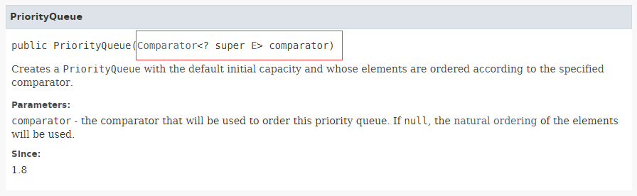

学习笔记

## 数组(Array)

关键字：线性表数据结构、连续的内存空间、相同类型的数据

注意：提防数组下标越界

## 链表(Linked List)

关键字：线性表数据结构、零散的内存空间、相同类型的数据

注意：

​      警惕指针流失和内存泄漏

​      利用哨兵简化难度

​      常用双指针法解题

工程中的应用：LRU Cache

## 跳表(Skip List)

关键字：元素有序，多维

注意：元素的增加和删除的时候，索引的跨度会改变。

空间复杂度：O(n)

工程中的应用：Redis

## 三种数据类型时间复杂度比较
| 操作    | 数组 | 链表 | 跳表     |
| ------- | ---- | ---- | -------- |
| prepend | O(1) | O(1) | O(log n) |
| append  | O(1) | O(1) | O(log n) |
| lookup  | O(1) | O(n) | O(log n) |
| insert  | O(n) | O(1) | O(log n) |
| delete  | O(n) | O(1) | O(log n) |

## Stack、Queue、Deque的原理和操作复杂度

### 栈（Stack)

​      **特点：**后进先出

​      **时间复杂度：**

​           添加、删除：O(1)

​           查询：O(n)

### 队列（Queue）

​      **特点：**先进先出

​     **时间复杂度：**

​           添加、删除：O(1)

####     Java源码解读：    

​      http://fuseyism.com/classpath/doc/java/util/Queue-source.html

​         特点：

   1. 在Java中Queue是一个泛型接口，继承Collection<E>

   2. Queue一共定义了6个接口

      |         | 操作失败会抛错误 | 操作失败会返回一个特殊的值 |
      | ------- | ---------------- | -------------------------- |
      | Insert  | boolean add(E e) | boolean offer(E e)         |
      | Remove  | E remove()       | E poll()                   |
      | Examine | E element()      | E peek()                   |

      

### 双端队列（Deque)

​      **特点：**两端都可以入队和出队操作（PS：**C#中没有这样的数据结构**）

​      **时间复杂度：**

​               插入、删除：O(1)

​               查询：O(n)

## 优先队列（PriorityQueue）

**C#没有这样的数据结构**

**特点：**

​       根据优先级

**时间复杂度：**

​       插入操作：O(1)

​      取出操作：O(logN)  按照元素的优先级取出

底层具体实现的数据结构较为多样复杂：heap, bst, treap

### Java中的PriorityQueue的特点：

https://docs.oracle.com/en/java/javase/12/docs/api/java.base/java/util/PriorityQueue.html

1. PriorityQueue 继承 Queue ，Queue有的方法，它也会有。

2. The elements of the priority queue are ordered according to their [natural ordering](https://docs.oracle.com/en/java/javase/12/docs/api/java.base/java/lang/Comparable.html), or by a [`Comparator`](https://docs.oracle.com/en/java/javase/12/docs/api/java.base/java/util/Comparator.html) provided at queue construction time, depending on which constructor is used. 

   PriorityQueue可以在创建的时候，指定元素的优先规则

   

   

