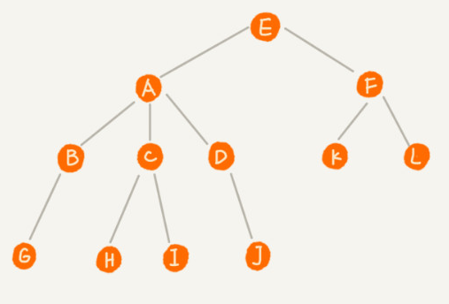
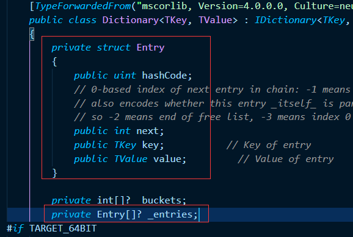
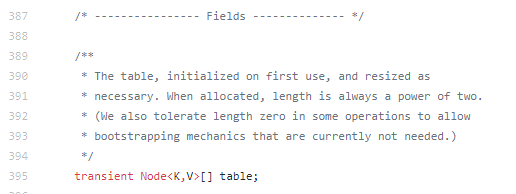
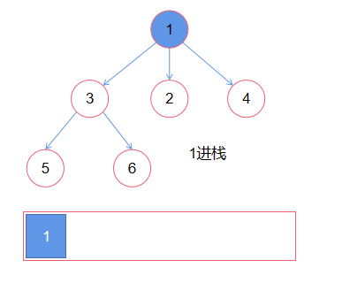
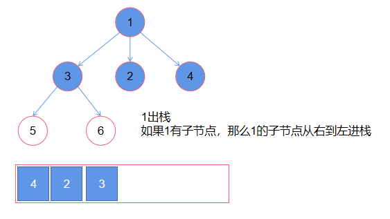
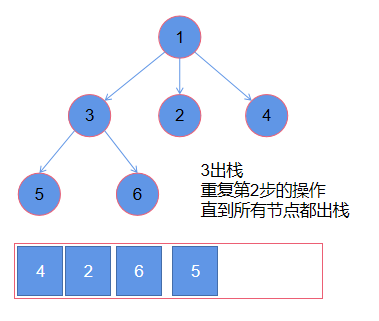

# 学习笔记

## 1. 知识总结

### 1.1. 哈希表、映射、集合

**哈希表：**根据关键码值二直接访问的数据结构。

` Key -> hash(Key) -> 存储该数据的内存地址，访问数据。`

映射和集合都是使用哈希表（或者二叉树）实现。映射和集合都是`Java`语言的概念。

<table> 
     <tr>
        <td></td>
        <td colspan="2">Java</td>
        <td colspan="2">C#</td>
     </tr>
     <tr>
        <td></td>
        <td>接口</td>
        <td>实现</td>
        <td>接口</td>
        <td>实现</td>
     </tr>
     <tr>
        <td>映射(key-value对，key不重复)</td>
        <td>Map</td>
        <td>HashMap <br/> Hashtable <br /> ConcurrentHashMap</td>
        <td>IDictionary</td>
        <td>Dictionary <br /> ConcurrentDictionary<br /> SortedDictionary <br /> SortedList</td> 
     </tr> 
     <tr>
        <td>集合(不重复元素的集合) </td>
        <td>Set</td>
        <td>HashSet <br/>TreeSet
        <td>ISet</td>
        <td>HashSet <br/> SortedSet</td>
     </tr> 
</table>


### 1.2. 树、二叉树、二叉搜索树



#### 1.2.1.  树的一些概念

节点的高度：节点到叶子节点的***最长路径***（边数）

节点的深度：根节点到这个节点所经历的***边的个数***

节点的层数：节点的深度 + 1

树的高度：根节点的高度


#### 1.2.2.  二叉树

儿子节点只有两个的树


#### 1.2.3. 二叉搜索树（二叉排序树、有序二叉树、排序二叉树）

##### 特点：

空树，或者有以下性质的二叉树：

1. 左子树上**所有节点**的值均小于它的根节点的值；
2. 右子树上**所有节点**的值均大于它的根节点的值；
3. 以此类推：左、右子树也分别为二叉查找树。

**结论：**中序遍历是升序排列


##### 常见操作：

​    查询：O(log N)

​    插入：O(log N)

​    删除：O(log N)


##### 遍历：

​    前序：父节点 -> 左子树 -> 右子树

​    中序：左子树 -> 父节点 -> 右子树

​    后序：左子树 -> 右子树 -> 父节点


### 1.3. 堆、二叉堆、图

#### 1.3.1. 堆

#####  特点：可以迅速找到一堆数中的最大或者最小值的数据结构

##### 具体实现：二叉堆、斐波拉契堆


#### 1.3.2. 二叉堆

通过完全二叉树来实现（注意：不是二叉搜索树）

##### 1.3.2.1 二叉堆（大顶）满足的性质

​      是一颗完全树

​      树中任意节点的值总是 >= 其子节点的值

##### 1.3.2.2 实现细节

​       一般都通过“数组”来实现

   - `arry[0] = root`

   - `arry[i] 的左孩子的索引是 (2 * i +1)`

   - `arry[i] 的右孩子的索引是 （2 * i + 2）`

   - `arry[i] 的父节点的索引是 floor((i - 1) / 2 )`

     

##### 1.3.2.3. 插入操作

新元素一律先插入到堆的尾部

依次向上调整整个堆的结构（一直到根即可）

时间复杂度：`O(log 2n)`


##### 1.3.2.4. 删除堆顶操作

将堆尾元素替换到顶部（即对顶被替代删除掉）

依次从根部向下调整整个堆的结构（一直到堆尾即可）

时间复杂度：`O(log n)`

##### 1.3.2.5. 工业应用

`Java：Priority Queue`


#### 1.3.3. 图

##### 1.3.3.1. 属性

`Graph(V,E)`

##### 点：V - vertex

度 —— 入度和出度

点与点之间：连通与否

##### 边：E - edge

有向和无向（单行线）

权重（边长）


#### 1.3.3.2. 表示方法

邻接矩阵（Adjacency matrix)

邻接表（Adjacency list)


#### 1.3.3.3. 常见算法

DFS —— 递归写法 ，一定要加 visited = set()


`Linked List是特殊化的Tree`

`Tree是特殊化的Graph，没有环的图就是树`


## 2. HashMap小结

​        我不会Java，不过HashMap是Key-Value的数据结构，在C#中跟它类型的数据结构有Dictionary, 那么我尝试用对Dictonary和HashMap比较来理解HashMap。

### **api对比**

| 方法              | Dictionary            | HashMap                     |
| ----------------- | --------------------- | --------------------------- |
| 插入              | Add(TKey,TValue) <br />除了用Add方法添加元素，还可以直接用索引器进行添加 | entrySet()                  |
| 判断是否存在Key   | ContainsKey(TKey)     | containsKey(Object key)     |
| 判断是否存在Value | ContainsValue(TValue) | containsValue(Object value) |
| 根据key获取对应的值 | 在C#中是直接用索引器获取 | get(Object key)             |

### **实现方式对比**

(1) 数据结构

都是使用数组存储一组对象

但是C#中next只记录元素的下标，而java中的next是一个对象

**C#：**



**Java：**




(2) C#中Dictionary添加和获取Value的实现

```c#
public TValue this[TKey key]
{
    get
    {
        ref TValue value = ref FindValue(key);
        if (!Unsafe.IsNullRef(ref value))
        {
            return value;
        }
        ThrowHelper.ThrowKeyNotFoundException(key);
        return default;
    }
    set
    {
        bool modified = TryInsert(key, value, InsertionBehavior.OverwriteExisting);
        Debug.Assert(modified);
    }
}
```

在C#中是通过索引器，使得操作Dictionary像操作数组那样简单。


(3) Java中的HashMap的get函数

   通过hash函数算出key的hash值，然后调用getNode方法

   通过hash在table数组中找到符合条件的元素

   把这个元素的hash值和key与传入的hash值和key进行比较，

​           如果相同，则返回这个元素

​           如果不同，后面的看不懂。

```java
/**
 * Returns the value to which the specified key is mapped,
 * or {@code null} if this map contains no mapping for the key.
 *
 * <p>More formally, if this map contains a mapping from a key
 * {@code k} to a value {@code v} such that {@code (key==null ? k==null :
 * key.equals(k))}, then this method returns {@code v}; otherwise
 * it returns {@code null}.  (There can be at most one such mapping.)
 *
 * <p>A return value of {@code null} does not <i>necessarily</i>
 * indicate that the map contains no mapping for the key; it's also
 * possible that the map explicitly maps the key to {@code null}.
 * The {@link #containsKey containsKey} operation may be used to
 * distinguish these two cases.
 *
 * @see #put(Object, Object)
 */
public V get(Object key) {
    Node<K,V> e;
    return (e = getNode(hash(key), key)) == null ? null : e.value;
}

/**
 * Implements Map.get and related methods
 *
 * @param hash hash for key
 * @param key the key
 * @return the node, or null if none
 */
final Node<K,V> getNode(int hash, Object key) {
    Node<K,V>[] tab; Node<K,V> first, e; int n; K k;
    if ((tab = table) != null && (n = tab.length) > 0 &&
        (first = tab[(n - 1) & hash]) != null) {
        if (first.hash == hash && // always check first node
            ((k = first.key) == key || (key != null && key.equals(k))))
            return first;
        if ((e = first.next) != null) {
            if (first instanceof TreeNode)
                return ((TreeNode<K,V>)first).getTreeNode(hash, key);
            do {
                if (e.hash == hash &&
                    ((k = e.key) == key || (key != null && key.equals(k))))
                    return e;
            } while ((e = e.next) != null);
        }
    }
    return null;
}
```


(4) Java中HashMap的put函数

```java
/**
 * Associates the specified value with the specified key in this map.
 * If the map previously contained a mapping for the key, the old
 * value is replaced.
 *
 * @param key key with which the specified value is to be associated
 * @param value value to be associated with the specified key
 * @return the previous value associated with <tt>key</tt>, or
 *         <tt>null</tt> if there was no mapping for <tt>key</tt>.
 *         (A <tt>null</tt> return can also indicate that the map
 *         previously associated <tt>null</tt> with <tt>key</tt>.)
 */
public V put(K key, V value) {
    return putVal(hash(key), key, value, false, true);
}

/**
 * Implements Map.put and related methods
 *
 * @param hash hash for key
 * @param key the key
 * @param value the value to put
 * @param onlyIfAbsent if true, don't change existing value
 * @param evict if false, the table is in creation mode.
 * @return previous value, or null if none
 */
final V putVal(int hash, K key, V value, boolean onlyIfAbsent,
               boolean evict) {
    Node<K,V>[] tab; Node<K,V> p; int n, i;
    if ((tab = table) == null || (n = tab.length) == 0)
        n = (tab = resize()).length;
    if ((p = tab[i = (n - 1) & hash]) == null)
        tab[i] = newNode(hash, key, value, null);
    else {
        Node<K,V> e; K k;
        if (p.hash == hash &&
            ((k = p.key) == key || (key != null && key.equals(k))))
            e = p;
        else if (p instanceof TreeNode)
            e = ((TreeNode<K,V>)p).putTreeVal(this, tab, hash, key, value);
        else {
            for (int binCount = 0; ; ++binCount) {
                if ((e = p.next) == null) {
                    p.next = newNode(hash, key, value, null);
                    if (binCount >= TREEIFY_THRESHOLD - 1) // -1 for 1st
                        treeifyBin(tab, hash);
                    break;
                }
                if (e.hash == hash &&
                    ((k = e.key) == key || (key != null && key.equals(k))))
                    break;
                p = e;
            }
        }
        if (e != null) { // existing mapping for key
            V oldValue = e.value;
            if (!onlyIfAbsent || oldValue == null)
                e.value = value;
            afterNodeAccess(e);
            return oldValue;
        }
    }
    ++modCount;
    if (++size > threshold)
        resize();
    afterNodeInsertion(evict);
    return null;
}
```


## 3. 刷题小结

### 589. N叉树的前序遍历

先遍历父节点，然后从子节点的左边开始遍历到右边

如果不用递归的方法解题，可以用一个栈辅助求解







时间复杂度：O(n)

空间复杂度：O(n)