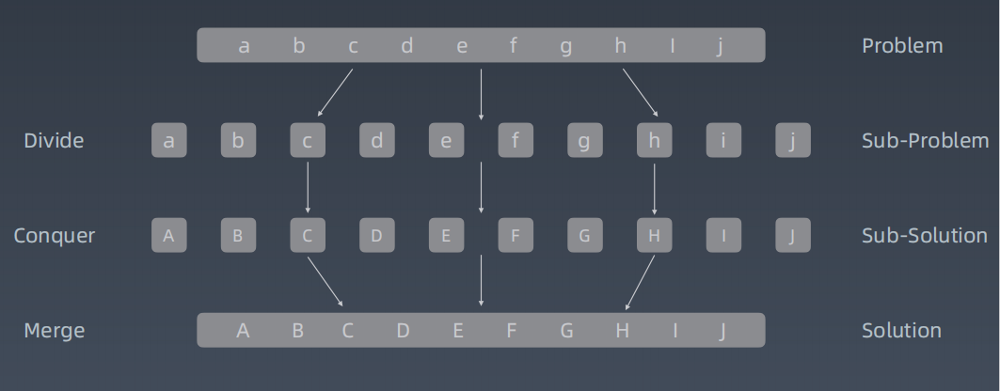

# 学习笔记

## 1. 知识总结

### 1.1 递归

自己调用自己

**特点：**

- 向下进入到不同的递归层，向上又回到原来的层。
- 用参数同步回到上一层
- 


**思维要点：**

- 不要人肉进行递归
- 找到最近最简单方法，将其拆解成可重复解决的问题（重复子问题）
- 数学归纳法思维


**递归代码模板**

```c#
public void recur(int level, int param) {
    // recursion terminator
    if(level > MAX_LEVEL) {
        // process result
        return;
    }
    
    // process current logic
    process(level, param);
    
    // drill down
    recur(level: level + 1, newParam);
    
    // restore current status
}
```


### 1.2 分治、回溯

本质上是递归



分治代码模板

```c#
public void DivideConquer(){
    // recursion terminator 
    
    // prepare data
    
    // conqure subproblems 
    
    // process and generate the final result
    
    // revert the current level states
}
```


## 2. 刷题小结

### 98. 验证二叉搜索树

利用二叉搜索树中序遍历的特点，中序遍历是递增的，

只要验证遍历过程中不存在当前节点大于前次节点就行了


### 105. 从前序和中序遍历序列构造二叉树

​    前序遍历：父 -> 左 -> 右，那么第1个元素是根节点

​    中序遍历：左 -> 父 -> 右，那么前序遍历的第1个元素把中序遍历的数组分成左右子树

​     利用这个特点使用递归方式构造二叉树

