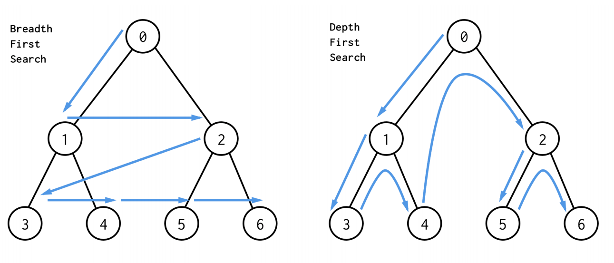

# 第4周 学习笔记

## 1. 知识总结

### 1.1. 深度优先搜索和广度优先搜索



**BFS示例代码：**

```c#
public void BFS<T>(T graph,int start,int end){
    var visited = new HashSet<T>();
    var queue=new Queue<T>();
    
    queue.Enqueue([start]); // 第1个节点入队
    
    while(queue.Count>0){
        T node = queue.Dequeue();
        visited.Add(node);
        
        process(node);
        
        List<T> nodes = generate_related_nodes(node);
        foreach(var item in nodes)
            queue.Enqueue(item);        
    }
    
    // other processing work    
}
```


**DFS示例代码 —— 递归：**

```c#
var visited =new HashSet<T>();

public void DFS<T>(T node,HashSet<T> visited){
    // terminator
    if(visited.Any(node)){
        // already visited
        return;
    }
    
    visited.Add(node);
    
    // process current node here.
    ...
    foreach(var nextNode in node.Children()){
        if(!visited.Any(nextNode))
            DFS(nextNode,visited);
    }
}
```


**DFS示例代码 —— 非递归：**

```c#
public List<T> DFS<T>(T tree){
    if(tree.Root == null) return new List<T>();
    
    var visited = new HashSet<T>();
    var stack = new Stack<T>();
    stack.Push(tree.Root);
    
    while(stack.Count>0){
         var node = stack.Pop();
         visited.Add(node);
        
         process(node);        
         List<T> nodes = generate_related_nodes(node);
        foreach(var item in nodes)
            stack.Push(item);
    } 
    
    // other processing work
}
```


### 1.2. 贪心算法

贪心：当下做局部最优判断

回溯：能够回退

动态规划：最优判断 + 回退


使用场景：选最近、选最优

​       问题能够分解成子问题，子问题的最优解能够递推到最终问题的最优解

### 1.3. 二分查找

**前提条件：**

1. 目标函数单调性（单调递增或者递减）
2. 存在上下界（bounded）
3. 能够通过索引访问（index accessible）

**时间复杂度：**O(log n)

**代码模板：**

非递归实现

```c#
// 二分查找的非递归实现
public int bsearch(int[] a, int n, int value) {
  int low = 0;
  int high = n - 1;

  while (low <= high) {
    int mid = low+(high-low)/2; // 防止 low + high 溢出
    if (a[mid] == value) {
      return mid;
    } else if (a[mid] < value) {
      low = mid + 1;
    } else {
      high = mid - 1;
    }
  }

  return -1;
}
```

递归实现：

```c#
// 二分查找的递归实现
public int bsearch(int[] a, int n, int val) {
  return bsearchInternally(a, 0, n - 1, val);
}

private int bsearchInternally(int[] a, int low, int high, int value) {
  if (low > high) return -1;

  int mid =  low + ((high - low) >> 1);
  if (a[mid] == value) {
    return mid;
  } else if (a[mid] < value) {
    return bsearchInternally(a, mid+1, high, value);
  } else {
    return bsearchInternally(a, low, mid-1, value);
  }
}
```


**二分查找应用场景的局限性：**

1. 二分查找依赖的是顺序表结构，简单点说就是数组。
2. 二分查找针对的是有序数据。
3. 数据量太大也不适合二分查找。（因为需要连续的内存空间）


### 使用二分查找，寻找一个半有序数组 [4, 5, 6, 7, 0, 1, 2] 中间无序的地方

思路：

     1. 选出中间位置的数据，跟左右相邻的数组是否有序
        2. 如果无序，返回数组的下标
        3. 如果有序，把左边和右边形成的新数组用键值对存入到一个栈（可以是普通数组、队列等）中。
        4. 继续对栈中数据进行步骤1的操作，直到栈中没有数据为止

```c#
public class Solution
{
    static void Main(string[] args)
    {
        int[] nums = new int[] { 6, 7, 0, 1, 2,4 ,5};

         var sol = new Solution();
         var result = sol.FindReverse(nums);
         Console.WriteLine(result);
         Console.ReadLine();
     }

     /// <summary>
     /// 查找数组中无序的地方
     /// </summary>
     /// <param name="nums"></param>
     /// <returns>如果数组有序，返回-1</returns>
     public int FindReverse(int[] nums)
     {          
         // 少于3个数是数组是一定有序的
         if (nums.Length <= 3) return -1; 
         
         var stack = new Stack<KeyValuePair<int,int>>();
         stack.Push(new KeyValuePair<int, int>(0, nums.Length - 1));

         while (stack.Count > 0)
         {
             var pair = stack.Pop();
             int mid = (pair.Value - pair.Key + 1) / 2;
             if(mid != pair.Key && mid!=pair.Value)               
             {
                 if((nums[mid-1]<nums[mid] && nums[mid]<nums[mid+1]) 
                     || (nums[mid - 1] > nums[mid] && nums[mid] > nums[mid + 1]))
                 {
                     // 有序
                     if (mid - 1 > pair.Key)
                         stack.Push(new KeyValuePair<int, int>(pair.Key, mid - 1));

                      if (mid + 1 < pair.Value)
                          stack.Push(new KeyValuePair<int, int>(mid + 1, pair.Value));
                  }
                  else
                  {
                      return mid;
                  }
              }
          }           

        return -1;
    }
}
```


## 2. 刷题小结

### 102. 二叉树的层次遍历

方法 1：递归

​     用 level 记录当前的层

​    用递归方法每层扫一次

方法 2：迭代

​      利用队列先进先出的特性

​       用 level 记录当前的层

方法 3：DFS

​      用`height`记录当前层次，

​      深度遍历的时候，将val保存在对应的层里面。


### 455. 分发饼干

​     贪心算法：先满足需求最小的孩子


### 860. 柠檬水找零

- 客户支付了 `5` 元，不用找零
- 客户支付了 `10` 元，如果没有 `5` 元，答案就是 `false`
- 客户支付了`20` 元，如果有 `1`张`10`元和`1`张`5`元，或者有`3`张`5`元，就可以找零，否则答案就是`false`


