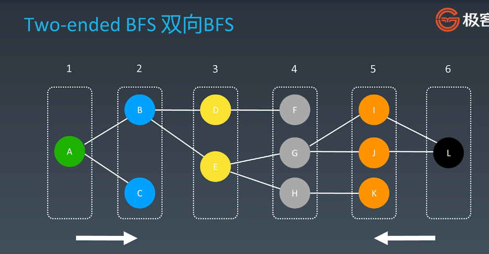

# 第7周 学习笔记

## 1. 知识总结

### 1.1. 字典树和并查集

#### 1.1.1. 字典树

字典树，即Trie树，又称单词查找树或键树，是一种属性结构。

​       典型应用是用于统计和排序大量的字符串（但不仅限于字符串），所以经常被搜索引擎系统用于文本词频统计。

优点：最大限度地减少无谓的字符串比较，查询效率比哈希表高。

字典树基本特性

1. 结点本身不存完整单词
2. 从根节点到某一节点，路径上经过的字符连接起来，为该节点对应的字符串
3. 每个节点的所有子节点路径代表的字符都不相同

代码模板
```java
class Trie {
    private boolean isEnd;
    private Trie[] next;
    /** Initialize your data structure here. */
    public Trie() {
        isEnd = false;
        next = new Trie[26];
    }
    
    /** Inserts a word into the trie. */
    public void insert(String word) {
        if (word == null || word.length() == 0) return;
        Trie curr = this;
        char[] words = word.toCharArray();
        for (int i = 0;i < words.length;i++) {
            int n = words[i] - 'a';
            if (curr.next[n] == null) curr.next[n] = new Trie();
            curr = curr.next[n];
        }
        curr.isEnd = true;
    }
    
    /** Returns if the word is in the trie. */
    public boolean search(String word) {
        Trie node = searchPrefix(word);
        return node != null && node.isEnd;
    }
    
    /** Returns if there is any word in the trie that starts with the given prefix. */
    public boolean startsWith(String prefix) {
        Trie node = searchPrefix(prefix);
        return node != null;
    }

    private Trie searchPrefix(String word) {
        Trie node = this;
        char[] words = word.toCharArray();
        for (int i = 0;i < words.length;i++) {
            node = node.next[words[i] - 'a'];
            if (node == null) return null;
        }
        return node;
    }
}
```

应用场景：

​     自动补全（搜索框）

​     拼写检查

​    IP路由

​    T9（九宫格）打字预测

​    单词游戏

#### 1.1.2. 并查集

使用场景：

​      组团、配对问题

​     Group or not ?

基本操作

​    makeSet(s)：建立一个新的并查集，其中包含s个单元素集合

​    unionSet(x,y)：把元素 x 和元素 y 所在的集合合并，要求 x 和 y 所在的集合不相交，如果相交则不合并。

​    find(x)：找到元素 x 所在的集合的代表，该操作也可以用于判断两个是否位于同一个集合，只要将他们各自的代表比较一下就可以了。


代码模板：

```java
class UnionFind { 
	private int count = 0; 
	private int[] parent; 
	public UnionFind(int n) { 
		count = n; 
		parent = new int[n]; 
		for (int i = 0; i < n; i++) { 
			parent[i] = i;
		}
	} 
	public int find(int p) { 
		while (p != parent[p]) { 
			parent[p] = parent[parent[p]]; 
			p = parent[p]; 
		}
		return p; 
	}
	public void union(int p, int q) { 
		int rootP = find(p); 
		int rootQ = find(q); 
		if (rootP == rootQ) return; 
		parent[rootP] = rootQ; 
		count--;
	}
}
```


### 1.2. 高级搜索

#### 1.2.1. 剪枝的实现和特性

初级搜索：

   1. 朴素搜索

   2. 优化方式：不重复（fibonacci）、剪枝（生成括号问题）

   3. 搜索方向：

      DFS：depth first search 深度优先索索

      BFS：breadth first search 广度优先搜索


高级搜索：

   双向搜索、启发式搜索


#### 1.2.2. 双向BFS的实现、特性




#### 1.2.3. 启发式搜索的实现、特性

Heuristic Search(A*)


估价函数

启发式函数：h(n)，它用来评价哪些结点最有希望的是一个我们要找的结点，h(n)会返回一个非负实数，也可以认为是从结点n的目标结点路径的估计成本。


启发式函数时一种告知搜索方向的方法。它提供了一种明智的方法来猜测哪个邻居结点会导向一个目标。


### 1.3. 红黑树和AVL树

#### AVL树

​      Balance Factor（平衡因子）

​                 它的左子树的高度减去它的右子树的高度（有时相反）。

​                 `balance factor = {-1,0,1}`

​     通过旋转操作进行平衡（四种）

​               左旋：右右子树

​               右旋：左左子树

​               左右旋：左右子树

​               右左旋：右左子树

**总结：**

   1. 平衡二叉树

   2. 每个节点存` balance factor = {-1,0,1}`

   3. 四种旋转操作

      不足：节点需要存储额外信息、且调整次数频繁

      

#### 红黑树

近似平衡的二叉搜索树，确保任何一个节点的左右子树的高度差小于两倍。

特点：

    1. 每个节点要么是红色，要么是黑色
       2. 根节点是红色
       3. 每个叶节点（NIL节点、空节点）是黑色的
       4. 不能有相邻接的两个红色节点
       5. 从任一节点到其每个叶子的所有路径都包含相同数目的黑色节点

**关键性质：**

​     从根到叶子的最长的可能路径不多于最短的可能路径的两倍长

## 2. 刷题小结

### [70. 爬楼梯](https://leetcode-cn.com/problems/climbing-stairs/)

```C#
public int ClimbStairs(int n)
{
    if (n <= 1)
        return 1;

    int a = 1, b = 1,result = 0;
            
    int step = 2;
    while (step <= n)
    {
        result = a + b;
        a = b;
        b = result;
        step++;
    }
    return result;
}
```


### [208.实现Trie（前缀树）](https://leetcode-cn.com/problems/implement-trie-prefix-tree/#/description)


```c#
public class Trie
{
    private class Node
    {
        /// <summary>
        /// 是否单词末尾节点
        /// </summary>
        public bool isTail = false;

        public Dictionary<char, Node> nextNode;
        public Node(bool isTail)
        {
            this.isTail = isTail;
            this.nextNode = new Dictionary<char, Node>();
        }
        public Node() : this(false)
        {
        }
    }

    /// <summary>
    /// 根节点
    /// </summary>
    private Node rootNode;
    private int size;
    private int maxLength;


    /** Initialize your data structure here. */
    public Trie()
    {
        this.rootNode = new Node();
        this.size = 0;
        this.maxLength = 0;
    }

    /** Inserts a word into the trie. */
    public void Insert(string word)
    {
        // 从根节点开始
        Node cur = this.rootNode;

        // 循环便利单词
        foreach (char c in word.ToCharArray())
        {
            if (!cur.nextNode.ContainsKey(c))
            {
                cur.nextNode.Add(c, new Node());
            }
            cur = cur.nextNode[c];
        }

        cur.isTail = true;
        if (word.Length > this.maxLength)
            this.maxLength = word.Length;
        size++;
    }

    /** Returns if the word is in the trie. */
    public bool Search(string word)
    {
        Node cur = FindLastNode(word);
        if (cur == null)
            return false;
        return cur.isTail;
    }

    /** Returns if there is any word in the trie that starts with the given prefix. */
    public bool StartsWith(string prefix)
    {
        Node cur = FindLastNode(prefix);

        if (cur == null)
            return false;

       return true;
   }   
        
   private Node FindLastNode(string word)
   {
       Node cur = this.rootNode;

       if (word.Length == 0)
       {
           if (cur.isTail)
           {
               return cur;
           }
           else
           {
               return null;
           }
       }        

       if (word.Length > this.maxLength)
           return null;

        foreach (char c in word.ToCharArray())
        {
            if (!cur.nextNode.ContainsKey(c))
                return null;
            cur = cur.nextNode[c];
        }
        return cur;
    }
}
```


### [547.朋友圈](https://leetcode-cn.com/problems/friend-circles)

使用并查集

```c#
public int FindCircleNum(int[][] M)
{
    int n = M.Length;
    UnionFind uf = new UnionFind(n);
    for(int i = 0; i < n - 1; i++)
    {
        for(int j = i + 1; j < n; j++)
        {
            if (M[i][j] == 1)
                uf.Union(i, j);
        }
    }
    return uf.Count();
}

private class UnionFind
{
    private int count = 0;
    private int[] parent;

    public UnionFind(int n)
    {
        count = n;
        parent = new int[n];
        for (int i = 0; i < n; i++)
            parent[i] = i;
    }

    public int Find(int p)
    {
        while(p!=parent[p])
        {
            parent[p] = parent[parent[p]];
            p = parent[p];
        }
        return p;
    }

    public void Union(int p,int q)
    {
        int rootP = Find(p);
        int rootQ = Find(q);
        if (rootP == rootQ) return;
        parent[rootP] = rootQ;
        count--;
    }

    public int Count()
    {
        return count;
    }
}
```