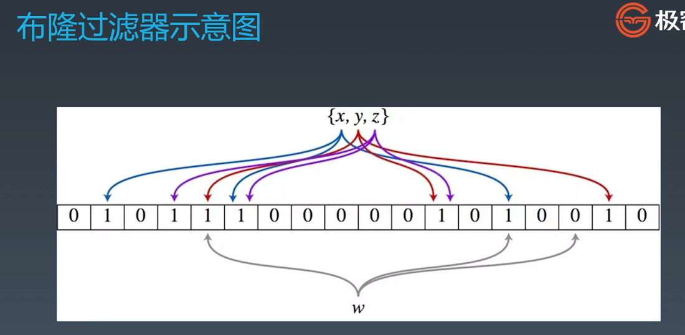
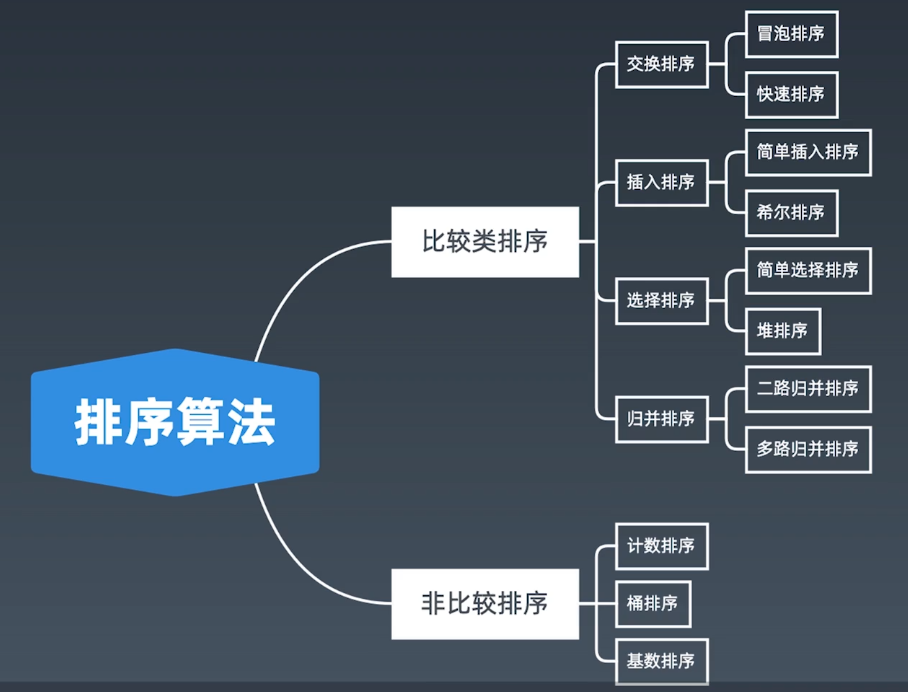
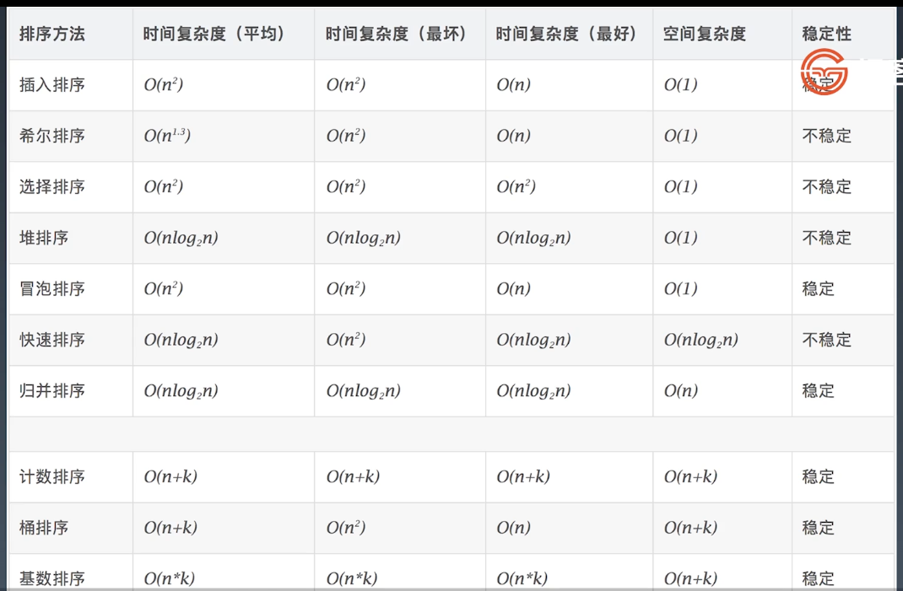

# 第8周 学习笔记

## 1. 知识总结

### 1.1. 位运算

#### 1.1.1. 位运算符

为什么需要位运算

​         机器里的数字表示方式和存储格式就是 二进制


从十进制 <——> 二进制

https://zh.wikihow.com/%E4%BB%8E%E5%8D%81%E8%BF%9B%E5%88%B6%E8%BD%AC%E6%8D%A2%E4%B8%BA%E4%BA%8C%E8%BF%9B%E5%88%B6


| 含义                         | 运算符 | 示例                                        |
| ---------------------------- | ------ | ------------------------------------------- |
| 左移                         | <<     | 0011 => 0110                                |
| 右移                         | >>     | 0110 => 0011                                |
| 按位或                       | \|     | 0011 <br />      ------- => 1011 <br />1011 |
| 按位与                       | &      | 0011 <br />      ------- => 0011 <br />1011 |
| 按位取反                     | ~      | 0011 => 1100                                |
| 按位异或（相同为零不同为一） | ^      | 0011 <br />      ------- => 1000 <br />1011 |


XOR - 异或

异或：相同为0，不同为1.也可用“不进位加法”来理解

异或操作的一些特点：

```c#
x ^ 0 = x
x ^ 1s = ~x  // 注意 1s = ~0
x ^(~x) = 1s
x ^ x = 0
c = a^b => a^c = b , b ^ c = a // 交换两数
a^b^c = a^(b^c) = (a^b)^c  // associative
```


#### 1.1.2. 算数移位与逻辑移位

指定位置的位运算

1. 将 x 最右边的 n 位清零：` x & (~0 << n)`
2. 获取 x 的第 n 位值（0或者1）：` (x>>n)&1`
3. 获取 x 的第 n 位的幂值：`x & (1<<n)`
4. 仅将第 n 位置为 1：`x|(1<<n)`
5. 仅将第 n 位置为 0：`x & (~(1<<n))`
6. 将 x 最高位至第 n 位（含）清零：`x&((1<<n)-1)`


#### 1.1.3. 位运算的应用

实战位运算要点

- 判断奇偶

  `x%2 == 1` ——> `(x&1) == 1`

  `x%2 == 0` ——> `(x&1) == 0`

- `x>>1` ——> `x/2`

  即：`x = x/2` ——> `x=x>>1`

  ​      `mid = (left + right)/2` ——> `mid = (left + right)>>1`

- `X=X&(X-1)`清零最低位的1

- `X& -X` => 得到最低位的1

- `X& ~X` => 0


### 1.2. 布隆过滤器和LRU缓存

#### 1.2.1. 布隆过滤器

​        一个很长的二进制向量和一系列随机映射函数。布隆过滤器可以用于检索一个元素是否在一个集合中。

优点：空间效率和查询时间都远远超过一般的算法

缺点：有一定的误识别率和删除困难。




应用场景：

1. 比特币网络

2. 分布式系统（Map-Reduce）—— Hadoop、search engine

3. Redis缓存

4. 垃圾邮件、评论等的过滤

   

#### 1.2.2. LRU缓存

替换策略

​    LFU - least frequently used

​    LRU - least recently used


### 1.3. 排序算法

#### 1.3.1. 排序算法分类

1. 比较类排序：

   通过比较来决定元素建的相对次序，由于其时间复杂度不能突破O(nlogn)，因此也称为非线性时间比较类排序。


2. 非比较类排序：

   不通过比较来决定元素建的相对次序，它可以突破基于比较排序的时间下界，以线性时间运行，因此也称为线性时间非比较类排序。







#### 1.3.2. 初级排序 O(n^2)

##### 1. 选择排序(selection Sort)

   每次找最小值，然后放到待排序数组的起始位置。

   ```C#
public void SelectionSort(int[] array)
{
    for(int i = 0; i < array.Length-1; i++)
    {
        for(int j = i + 1; j < array.Length; j++)
        {
            if (array[i] > array[j])
            {
                int tmp = array[i];
                array[i] = array[j];
                array[j] = tmp;
            }
        }
    }
}
   ```

   

##### 2. 插入排序（Insertion Sort）

   从前到后逐步构建有序序列；对于未排序数据，在已排序序列中从后向前扫描，找到响应位置并插入。

```C#
public void InsertionSort(int[] array)
{
    for(int i = 1; i < array.Length; i++)
    {
        int tmp = array[i];
        int j = i - 1;
        while(j>=0 && tmp < array[j])
        {
            array[j + 1] = array[j];
            j--;
        }
        array[j + 1] = tmp;
    }
}
```

   

##### 3. 冒泡排序（Bubble Sort）

   嵌套循环，每次查看相邻的元素如果逆序，则交换。

```C#
public void BubbleSort(int[] array)
{
    for(int i = 0; i < array.Length - 1; i++)
    {
        // 有序标记，每一轮的初始值都是true
        bool isSorted = true;
        // 无序数列的边界，每次比较只需比较到这里为止
        int sortBorder = array.Length - 1-i;
        for(int j = 0; j < sortBorder; j++)
        {
            int tmp = 0;
            if (array[j] > array[j + 1])
            {
                tmp = array[j];
                array[j] = array[j + 1];
                array[j + 1] = tmp;
                // 因为有元素进行交换，所以不是有序的，标记为false
                isSorted = false;
                // 把无序数列的边界更新为最后一次交换元素的位置
                sortBorder = j;
            }
        }
        if (isSorted)
            break;
    }
}
```


#### 1.3.3. 高级排序 O(N*LogN)

1. 快速排序（Quick Sort）

   ​       数组取标杆 pivot，将小元素方 pivot左边，大元素放右侧，然后依次对左边和右边的子数组继续快排；以达到整个序列有序。

   

2. 归并排序（Merge Sort）——分治

   - 把长度为 n 的输入序列分成两个长度为 n/2 的子序列；

   - 对这两个子序列分别采用归并排序；

   - 将两个排序好的子序列合并成一个最终的排序序列。


归并和快排的比较

​        两者具有相似性，但步骤顺序相反

​        归并：先排序左右子数组，然后合并两个有序子数组

​       快排：先调配出左右子数组，然后对于左右子数组进行排序


3. 堆排序（Heap Sort）

​            堆插入 O（logN），取最大/小值 O（1）

- 数组元素依次建立小顶堆
- 依次取堆顶元素，并删除


#### 1.3.4. 特殊排序 O(n)

1. 计数排序（Counting Sort）

   ​        计数排序要求输入的数据必须是有确定范围的整数。将输入的数据值转化为键存储在额外开辟的数组空间中；然后依次把计数大于 1 的填充回原数组

2. 桶排序(Bucket Sort)

   ​       假设输入数据服从均匀分布，将数据分到有限数量的桶里，每个桶再分别排序（有可能再使用别的排序算法或是以递归方式继续使用桶排序进行排序）。

3. 基数排序（Radix Sort)

   ​        基数排序是按照低位先排序，然后收集；再按照高位排序，然后再收集；依次类推，直到最高位。有时候有些属性是有优先级顺序的，先按低有限排序，再按高优先级排序。


## 2. 刷题小结

### [191. 位1的个数](https://leetcode-cn.com/problems/number-of-1-bits/)

```c#
 public int HammingWeight(uint n)
 {
     int count = 0;
     while (n != 0)
     {
         if ((n & 1) == 1)
         {
             count++;
         }
         n = n >> 1;
     }
     return count;
 }
```


### [231. 2的幂](https://leetcode-cn.com/problems/power-of-two/)

方法1：使用内置的log函数
```c#
public bool IsPowerOfTwo(int n)
{
    if (n <= 0) return false;
    double l = Math.Log(n,2);
    return int.TryParse(l.ToString(), out int a);
}
```

方法2：mod 2
```c#
 public bool IsPowerOfTwo(int n)
 {
     if (n <= 0) return false;
     
     while (n % 2 == 0)
         n /= 2;

    return n == 1;
}
```
方法3：位运算
```c#
public bool IsPowerOfTwo(int n)
{
    // 二进制位有且只有1个1
    if (n <= 0) return false;
    return (n & (n - 1)) == 0;          
}
```


### [338.  比特位计数](https://leetcode-cn.com/problems/counting-bits/)

```c#
public int[] CountBits(int num)
{
    int[] dp = new int[num + 1];

    for(int i = 1; i <= num; i++)
    {
        dp[i] = dp[i & (i - 1)] + 1;
    }

    return dp;
}
```

### [190. 颠倒二进制位](https://leetcode-cn.com/problems/reverse-bits/)

```C#
public uint reverseBits(uint n)
{
    uint result = 0;
    for(int i = 0; i < 32; i++)
    {
        result = (result << 1) | (n & 1);
        n >>= 1;
    }
    return result;
}
```

### [1122. 数组的相对排序](https://leetcode-cn.com/problems/relative-sort-array/)

```C#
public int[] RelativeSortArray(int[] arr1, int[] arr2)
{
    int[] countArray = new int[1001];
    int[] result = new int[arr1.Length];
    int k = 0;

    for (int i = 0; i < arr1.Length; i++)
        countArray[arr1[i]]++;

    for(int i = 0; i < arr2.Length; i++)
    {
        while (countArray[arr2[i]] > 0)
        {
            result[k++] = arr2[i];
            countArray[arr2[i]]--;
        }
    }

    for(int i = 0; i < countArray.Length; i++)
    {
        while (countArray[i] > 0)
        {
            result[k++] = i;
            countArray[i]--;
        }
    }

        return result;
    }
}
```

